# Grafana Alerting Module Architecture

## Overview

Grafana's unified alerting system spans three layers:

| Layer | Location | Role |
|-------|----------|------|
| K8s API surface | `apps/alerting/{rules,notifications,historian}/` | Declarative CRUD via App SDK |
| Registry bridge | `pkg/registry/apps/alerting/` | Wire DI, authz, legacy SQL adapters |
| Runtime engine | `pkg/services/ngalert/` | Evaluation, scheduling, state, Alertmanager, HTTP API |

The frontend lives in `public/app/features/alerting/unified/` and uses RTK Query against the backend HTTP API.

---

## High-Level Architecture

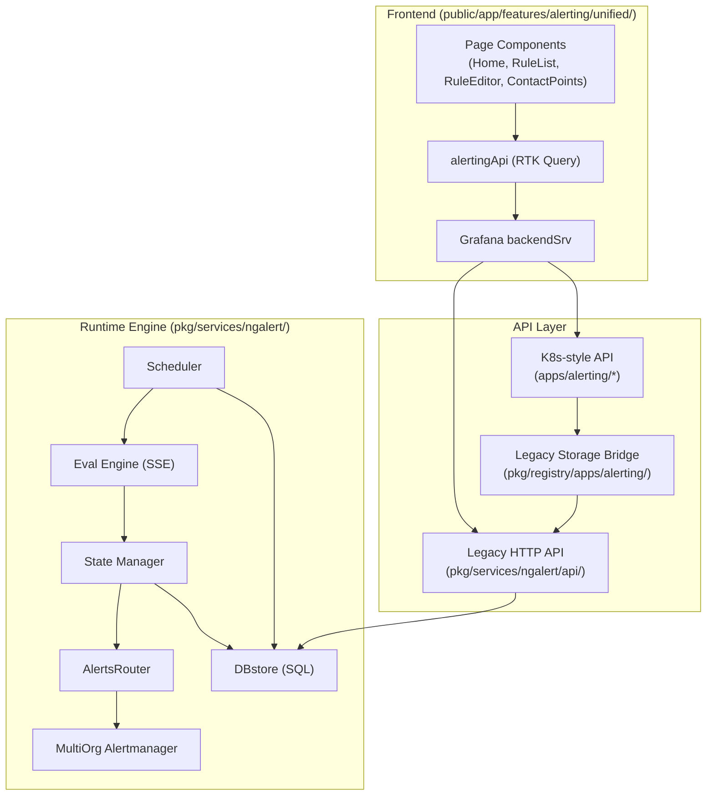

---

## Backend Package Structure

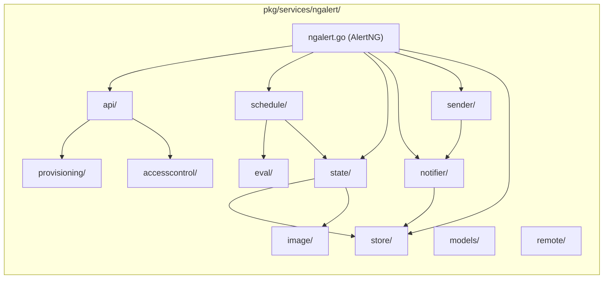

---

## Service Initialization (Wire DI)

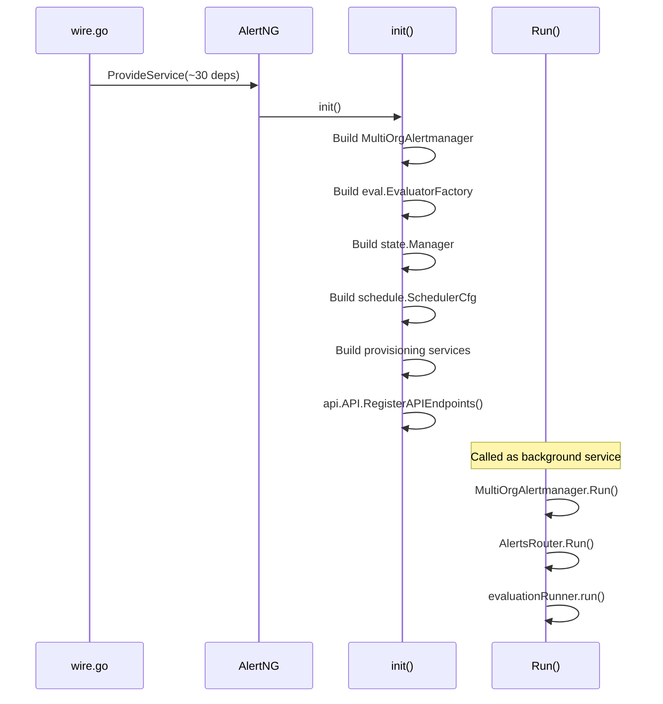

---

## HTTP Request Flow

### API Endpoint Groups

| Group | Prefix | Purpose |
|-------|--------|---------|
| Alertmanager | `/api/alertmanager/grafana/...` | Config, silences, receivers |
| Ruler | `/api/ruler/grafana/api/v1/rules/...` | Rule CRUD |
| Prometheus | `/api/prometheus/grafana/api/v1/rules` | Rule status (compat) |
| Provisioning | `/api/v1/provisioning/...` | File/API provisioning |
| Testing | `/api/ruler/grafana/api/v1/rules/test` | Rule/contact point testing |
| History | `/api/v1/state/history` | State history queries |
| Convert | `/api/convert/prometheus/...` | Prometheus rule import |
| Admin | `/api/admin/alerting/...` | External AM config |

### Forking Pattern (Grafana vs External Datasource)

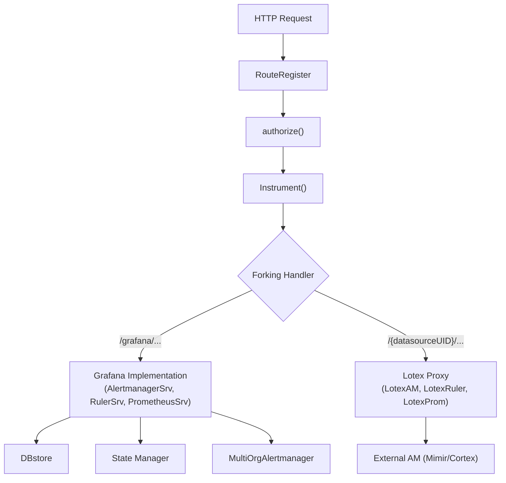

### Route Registration Middleware Stack

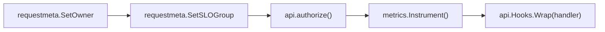

---

## Rule Evaluation Pipeline

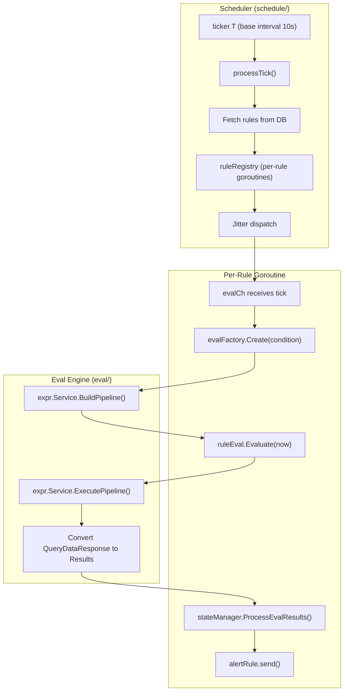

### Evaluation Result Classification

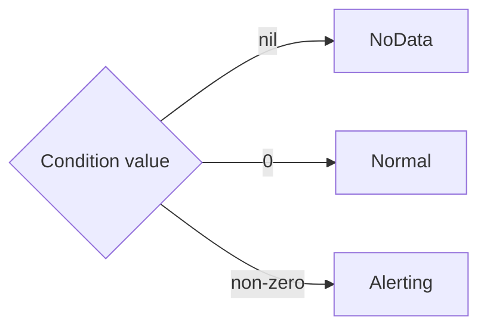

### State Transitions

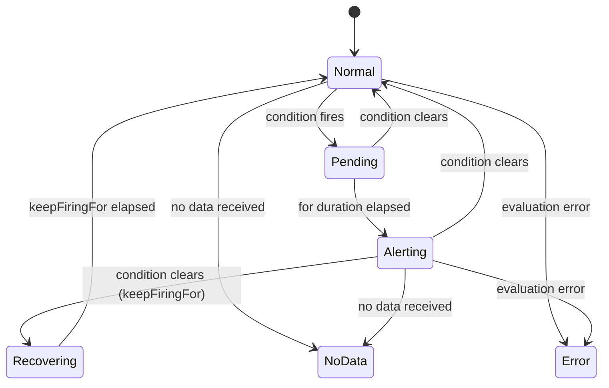

---

## State Management Flow

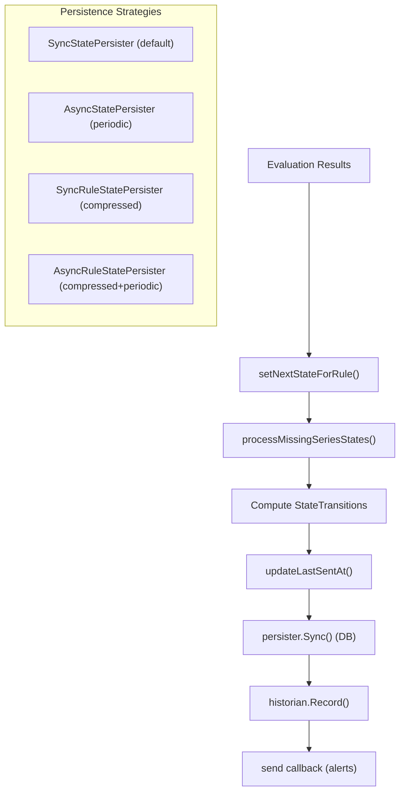

### State Manager Lifecycle

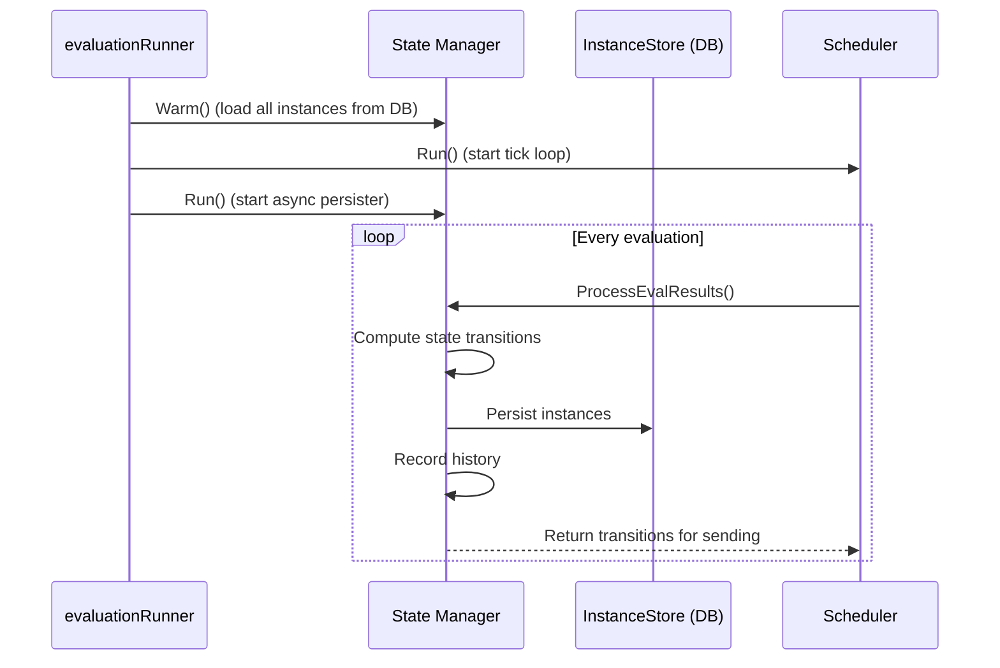

---

## Notification Pipeline

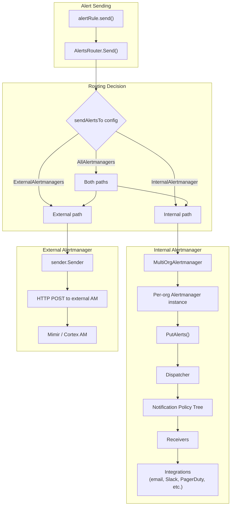

### MultiOrgAlertmanager Structure

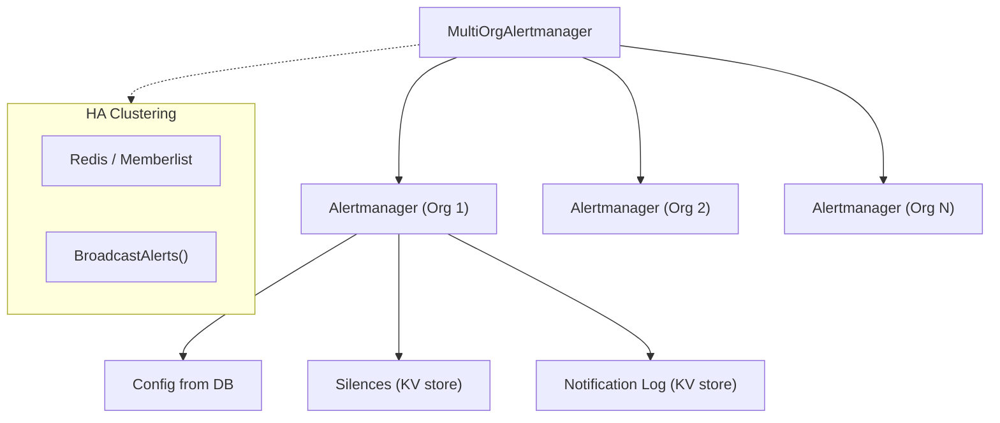

---

## K8s App SDK Layer

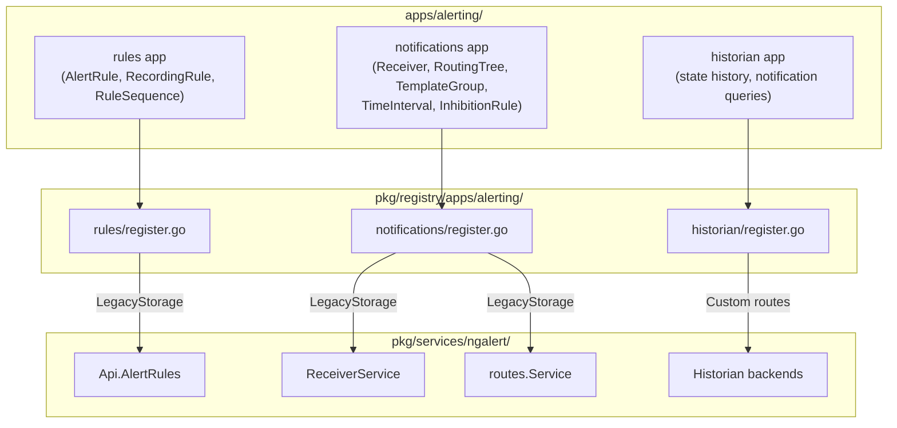

---

## Frontend Architecture

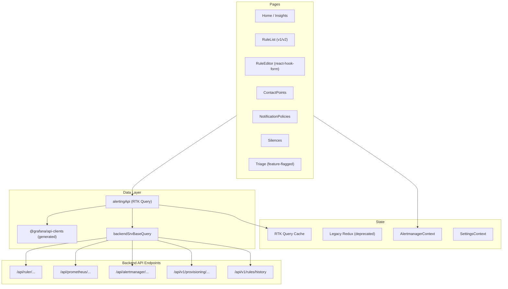

### Frontend Routing

| Path | Component | Purpose |
|------|-----------|---------|
| `/alerting` | Home | Landing + insights |
| `/alerting/list` | RuleList | Rules (v1 or v2 via feature flag) |
| `/alerting/new/:type?` | RuleEditor | Create rule |
| `/alerting/:id/edit` | RuleEditor | Edit rule |
| `/alerting/notifications` | ContactPoints | Contact points CRUD |
| `/alerting/routes` | NotificationPolicies | Routing tree |
| `/alerting/silences` | Silences | Silence list |
| `/alerting/groups` | AlertGroups | Active alert groups |
| `/alerting/history` | CentralAlertHistoryPage | State history |
| `/alerting/alerts` | Triage | Triage workbench |
| `/alerting/admin/alertmanager` | Settings | Admin config |

---

## End-to-End Request Flow: Rule Evaluation

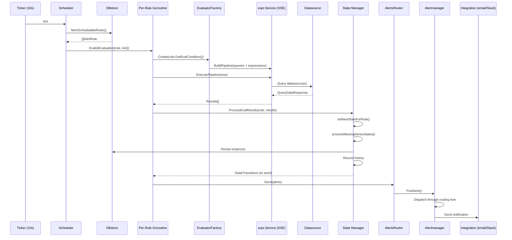

---

## End-to-End Request Flow: Rule CRUD (API)

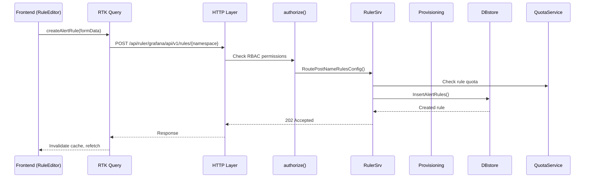

---

## Dependencies Between Components

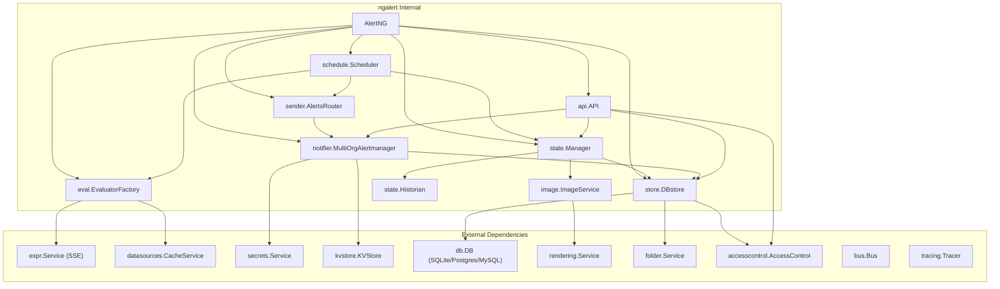

---

## HA (High Availability) Mode

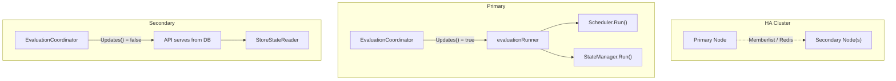

---

## Key Data Models

| Model | Identity | Purpose |
|-------|----------|---------|
| `AlertRule` | `{OrgID, UID}` | Full rule definition (queries, condition, labels, for duration) |
| `AlertInstance` | `{RuleOrgID, RuleUID, LabelsHash}` | Persisted alert state per label set |
| `AlertConfiguration` | `{OrgID}` | Serialized Alertmanager config |
| `Receiver` | name within config | Contact point (integrations list) |
| `NotificationSettings` | embedded in rule | Override default routing for a rule |
| `State` (runtime) | `CacheID (Fingerprint)` | In-memory state with timing and transition data |

---

## Feature Flags Affecting Alerting

| Flag | Effect |
|------|--------|
| `alertingListViewV2` | Switches rule list to v2 implementation |
| `alertingTriage` | Enables triage workbench UI |
| `alertingSaveStatePeriodic` | Async state persistence |
| `alertingSaveStateCompressed` | Protobuf-compressed state persistence |
| `kubernetesAlertingHistorian` | Enables K8s historian app |
| Feature flags for remote AM | Switches to Mimir/Cortex Alertmanager modes |
