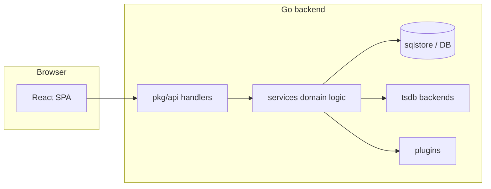

# Grafana application architecture

This document summarizes how the Grafana monorepo is structured for contributors and agents. Official deep dives also live under `contribute/architecture/` and `contribute/backend/`.

## System shape

Grafana is a **monitoring and observability web application**: a **Go** HTTP server serves APIs and static UI, while the **TypeScript/React** SPA provides dashboards, Explore, alerting UX, and admin flows. In development, the backend can proxy to a separate frontend dev server.

- **Backend entry and composition**: `pkg/server/` wires the process together with **Google Wire** dependency injection (`make gen-go` after changing constructors/graphs).
- **HTTP surface**: `pkg/api/` registers routes and handlers; handlers stay thin and delegate to **`pkg/services/<domain>/`**.
- **Data path**: Time-series and datasource queries go through **`pkg/tsdb/`** and related services; relational state uses **`sqlstore`** (migrations in `pkg/services/sqlstore/migrations/`).
- **Plugins**: Load and communicate via **`pkg/plugins/`** (including gRPC/protobuf where applicable).

## Frontend layout (`public/app/`)

| Area | Role |
|------|------|
| `core/` | Shared services, utilities, cross-cutting UI helpers |
| `features/` | Domain features (dashboard, alerting, explore, etc.) |
| `plugins/` | Built-in app and datasource plugins (many are Yarn workspaces) |
| `store/` | Redux store setup |
| `types/` | Shared TypeScript types |

**Patterns**: React function components and hooks, **Redux Toolkit** slices, **RTK Query** for data fetching, **Emotion** (`useStyles2`) for styling, **React Testing Library** for tests.

## Shared packages (`packages/`)

Publishable workspaces consumed by the app, including:

- `@grafana/data` — frames, field types, time utilities
- `@grafana/ui` — design system components
- `@grafana/runtime` — app services available to plugins
- `@grafana/schema` — types generated from CUE (see below)
- `@grafana/scenes` — dashboard scene model

## Declarative schemas and flags

- **`kinds/`** + CUE: dashboard/panel (and related) schemas; **`make gen-cue`** regenerates Go and TypeScript.
- **Feature toggles**: `pkg/services/featuremgmt/` — **`make gen-feature-toggles`** after edits.

## Backend apps (`apps/`)

Standalone Go binaries using the **Grafana App SDK** (for example `apps/dashboard/`, `apps/folder/`, `apps/alerting/`), deployed and versioned alongside core when applicable.

## Configuration and builds

- **Config**: defaults in `conf/defaults.ini`, local overrides in `conf/custom.ini`.
- **Go modules**: `go.work` defines the workspace; **`make update-workspace`** when adding modules.
- **Build tags**: `oss` (default), `enterprise`, `pro`.

## Mental model (request flow)

For day-to-day commands (run, test, lint, codegen), see the root **`AGENTS.md`**.
