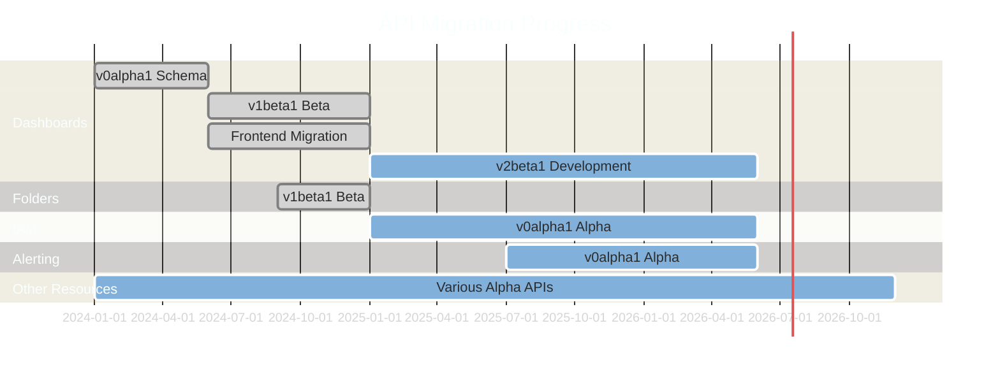

# Grafana API to APIs Migration Status

This document tracks the ongoing migration from Grafana's Legacy APIs (`/api/...`) to the new Kubernetes-inspired Resource APIs (`/apis/...`).

## Overview

Grafana is adopting a Kubernetes-inspired, resource-oriented model for all core resources. The new Resource APIs provide:

- **Consistent URL structure and versioning** (`/apis/<group>/<version>/namespaces/<namespace>/<resource>`)
- **Well-defined schemas** with CUE definitions and always-in-sync OpenAPI specs
- **Explicit namespacing** for org/stack context
- **Standardized error handling** following Kubernetes conventions
- **Built-in convenience features** like resource history, restore, and observability-as-code tooling

The end goal is for Resource APIs to become the only interface for managing core Grafana resources, with Legacy APIs eventually deprecated and removed.

## Migration Stages

Each resource follows this migration path:

| Stage | Description |
|-------|-------------|
| 1. Schema Definition | CUE schema defined in `apps/*/kinds/*.cue` |
| 2. Alpha (`v0alpha1`/`v1alpha1`) | Initial Resource API handlers, experimental |
| 3. Beta (`v1beta1`) | Stable schema, feature flag enabled by default |
| 4. GA (`v1`) | Production-ready, strong stability guarantees |
| 5. Legacy Deprecation | Legacy API deprecated after GA promotion |
| 6. Legacy Removal | Legacy API removed after deprecation period |

## Resource Migration Status

### Core Resources

| Resource | Group | Current Version | Stage | Feature Flag | Status |
|----------|-------|-----------------|-------|--------------|--------|
| Dashboard | `dashboard.grafana.app` | `v1beta1` (preferred), `v2beta1` | Beta | `kubernetesDashboards` (GA) | Frontend migrated, in production |
| Folder | `folder.grafana.app` | `v1beta1` | Beta | - | Migrated |
| Playlist | `playlist.grafana.app` | `v0alpha1` | Alpha | - | API available |
| Short URL | `shorturl.grafana.app` | `v1beta1` | Beta | `kubernetesShortURLs` | In progress |
| Preferences | `preferences.grafana.app` | `v1alpha1` | Alpha | - | API available |

### Alerting Resources

| Resource | Group | Current Version | Stage | Feature Flag | Status |
|----------|-------|-----------------|-------|--------------|--------|
| Alert Rules | `alerting.grafana.app` | `v0alpha1` | Alpha | `kubernetesAlertingRules` | Experimental |
| Recording Rules | `alerting.grafana.app` | `v0alpha1` | Alpha | `kubernetesAlertingRules` | Experimental |
| Alerting Historian | `alerting.grafana.app` | `v0alpha1` | Alpha | `kubernetesAlertingHistorian` | Experimental |
| Notifications (Receivers, Routes, Templates) | `notifications.alerting.grafana.app` | `v0alpha1` | Alpha | - | API available |

### Identity & Access Management (IAM)

| Resource | Group | Current Version | Stage | Feature Flag | Status |
|----------|-------|-----------------|-------|--------------|--------|
| User | `iam.grafana.app` | `v0alpha1` | Alpha | - | API available |
| Team | `iam.grafana.app` | `v0alpha1` | Alpha | - | API available |
| Team Binding | `iam.grafana.app` | `v0alpha1` | Alpha | `kubernetesTeamBindings` | Experimental |
| Service Account | `iam.grafana.app` | `v0alpha1` | Alpha | - | API available |
| Role | `iam.grafana.app` | `v0alpha1` | Alpha | `kubernetesAuthzRolesApi` | Experimental |
| Role Binding | `iam.grafana.app` | `v0alpha1` | Alpha | `kubernetesAuthzRoleBindingsApi` | Experimental |
| Core Role | `iam.grafana.app` | `v0alpha1` | Alpha | `kubernetesAuthzCoreRolesApi` | Experimental |
| Global Role | `iam.grafana.app` | `v0alpha1` | Alpha | `kubernetesAuthzGlobalRolesApi` | Experimental |
| Resource Permission | `iam.grafana.app` | `v0alpha1` | Alpha | `kubernetesAuthzResourcePermissionApis` | Experimental |
| External Group Mapping | `iam.grafana.app` | `v0alpha1` | Alpha | `kubernetesExternalGroupMapping` | Experimental |
| Team LBAC Rule | `iam.grafana.app` | `v0alpha1` | Alpha | `kubernetesAuthzTeamLBACRuleApi` | Experimental |

### Other Resources

| Resource | Group | Current Version | Stage | Feature Flag | Status |
|----------|-------|-----------------|-------|--------------|--------|
| Annotation | `annotation.grafana.app` | `v0alpha1` | Alpha | `kubernetesAnnotations` | Experimental |
| Correlations | `correlations.grafana.app` | `v0alpha1` | Alpha | `kubernetesCorrelations` | Experimental |
| Collections (Stars) | `collections.grafana.app` | `v1alpha1` | Alpha | `kubernetesStars` | Experimental |
| Logs Drilldown | `logsdrilldown.grafana.app` | `v1alpha1`, `v1beta1` | Alpha/Beta | `kubernetesLogsDrilldown` | Experimental |
| Provisioning (Repository, Connection) | `provisioning.grafana.app` | `v0alpha1` | Alpha | - | API available |
| Snapshots | `dashboard.grafana.app` | `v0alpha1` | Alpha | `kubernetesSnapshots` | Experimental |
| Library Panels | - | - | Alpha | `kubernetesLibraryPanels` | Experimental |
| Secrets | `secret.grafana.app` | `v1beta1` | Beta | - | API available |
| Advisor | `advisor.grafana.app` | `v0alpha1` | Alpha | - | API available |
| Plugins | `plugins.grafana.app` | `v0alpha1` | Alpha | - | API available |
| Query Caching | - | - | Alpha | `kubernetesQueryCaching` | Experimental |
| Quotas | `quotas.grafana.app` | `v0alpha1` | Alpha | `kubernetesUnifiedStorageQuotas` | Experimental |

## Frontend API Clients Status

The `@grafana/api-clients` package (currently in BETA) provides RTK Query clients for the new Resource APIs.

### Available Clients

| Client | Version(s) | Status |
|--------|-----------|--------|
| Dashboard | `v0alpha1`, `v1beta1`, `v2beta1` | Available |
| Folder | `v1beta1` | Available |
| Playlist | `v0alpha1` | Available |
| Short URL | `v1beta1` | Available |
| Preferences | `v1alpha1` | Available |
| IAM | `v0alpha1` | Available |
| Alerting Rules | `v0alpha1` | Available |
| Alerting Historian | `v0alpha1` | Available |
| Alerting Notifications | `v0alpha1` | Available |
| Collections | `v1alpha1` | Available |
| Correlations | `v0alpha1` | Available |
| Logs Drilldown | `v1alpha1`, `v1beta1` | Available |
| Provisioning | `v0alpha1` | Available |
| Advisor | `v0alpha1` | Available |
| Legacy (fallback) | - | Available |

## Unified Storage Status

Unified Storage (`pkg/storage/unified/...`) is the persistence layer backing Resource APIs.

| Feature | Status | Feature Flag |
|---------|--------|--------------|
| Core Storage | Active | - |
| Search | Active | `unifiedStorageSearch` |
| Search UI | Experimental | `unifiedStorageSearchUI` |
| Big Objects Support | Experimental | `unifiedStorageBigObjectsSupport` |
| gRPC Connection Pool | Experimental | `unifiedStorageGrpcConnectionPool` |
| Dual Reader | Experimental | `unifiedStorageSearchDualReaderEnabled` |

## GA Features

The following migration-related features have reached General Availability:

- **`kubernetesDashboards`**: Frontend uses Kubernetes API for dashboards (enabled by default)
- Dashboard Resource API (`v1beta1`) is the preferred version

## Migration Timeline Summary

## Implementation Approaches

### Registry Approach (`pkg/registry/apis/...`)

Original method using Go code for API registration. Used for:
- Legacy fallbacks when data exists outside unified storage
- Resources not yet migrated to Apps approach

### Apps Approach (`apps/...`)

Newer, modular implementation with CUE schemas. This is the direction for all new resources:
- Schema-first with strong typing and validation
- Self-contained modules with versioning
- Controller/reconciler support via App SDK

## Key Files and Directories

| Path | Description |
|------|-------------|
| `apps/*/kinds/*.cue` | CUE schema definitions |
| `pkg/registry/apis/` | API registration (Registry approach) |
| `pkg/storage/unified/` | Unified Storage implementation |
| `packages/grafana-api-clients/` | Frontend RTK Query clients |
| `pkg/services/featuremgmt/` | Feature flag definitions |
| `contribute/architecture/k8s-inspired-backend-arch.md` | Architecture documentation |

## References

- [Kubernetes-inspired Backend Architecture](./k8s-inspired-backend-arch.md)
- [New API Structure Documentation](../../docs/sources/developer-resources/api-reference/http-api/apis.md)
- [Feature Toggles](../../docs/sources/setup-grafana/configure-grafana/feature-toggles/index.md)
