# Grafana Alerting Module Investigation

This document provides a comprehensive analysis of the Grafana alerting module, covering architecture, request flows, dependencies, and business logic.

## Table of Contents

1. [Overview](#overview)
2. [Architecture](#architecture)
3. [Backend Components](#backend-components)
4. [Frontend Components](#frontend-components)
5. [Request Flows](#request-flows)
6. [Data Models](#data-models)
7. [Dependencies](#dependencies)
8. [Business Logic](#business-logic)

---

## Overview

Grafana's Unified Alerting system is a monitoring and observability platform component that evaluates alert conditions, manages alert state, and sends notifications. It consists of:

- **Backend** (`pkg/services/ngalert/`): Go services handling rule evaluation, state management, and notification routing
- **Frontend** (`public/app/features/alerting/unified/`): React/TypeScript UI for managing alerts, rules, and configurations

### High-Level Architecture

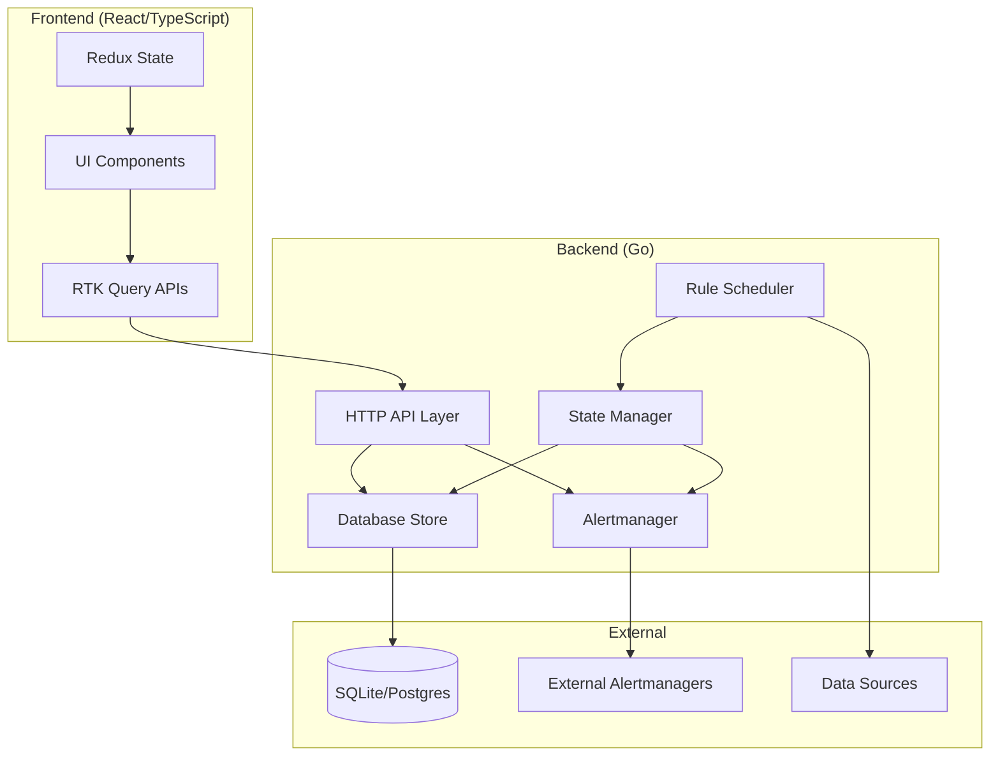

---

## Architecture

### System Components Diagram

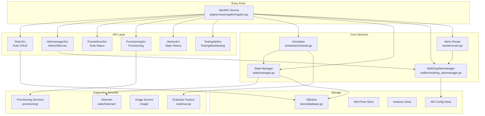

---

## Backend Components

### Directory Structure

| Directory | Purpose |
|-----------|---------|
| `pkg/services/ngalert/api/` | HTTP API handlers and routes |
| `pkg/services/ngalert/store/` | Database storage layer |
| `pkg/services/ngalert/models/` | Domain models and data structures |
| `pkg/services/ngalert/schedule/` | Alert rule evaluation scheduler |
| `pkg/services/ngalert/state/` | Alert state management and caching |
| `pkg/services/ngalert/notifier/` | Alertmanager integration |
| `pkg/services/ngalert/sender/` | Alert routing to external Alertmanagers |
| `pkg/services/ngalert/eval/` | Rule evaluation logic |
| `pkg/services/ngalert/provisioning/` | Provisioning services |
| `pkg/services/ngalert/accesscontrol/` | RBAC for alerting resources |
| `pkg/services/ngalert/image/` | Screenshot capture for alerts |
| `pkg/services/ngalert/remote/` | Remote Alertmanager integration |
| `pkg/services/ngalert/writer/` | Recording rules remote write |

### Core Service Interfaces

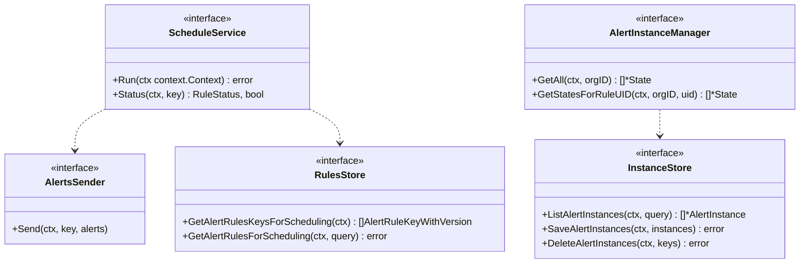

### API Handlers

| Handler | Registration Method | Purpose |
|---------|-------------------|---------|
| `AlertmanagerSrv` | `RegisterAlertmanagerApiEndpoints` | Alertmanager-compatible APIs (alerts, silences, receivers) |
| `PrometheusSrv` | `RegisterPrometheusApiEndpoints` | Prometheus-compatible APIs (rule status, alerts) |
| `RulerSrv` | `RegisterRulerApiEndpoints` | Cortex Ruler-compatible APIs (rule CRUD) |
| `ProvisioningSrv` | `RegisterProvisioningApiEndpoints` | Provisioning APIs |
| `ConfigSrv` | `RegisterConfigurationApiEndpoints` | Admin configuration |
| `HistorySrv` | `RegisterHistoryApiEndpoints` | State history queries |
| `TestingApiSrv` | `RegisterTestingApiEndpoints` | Rule testing/backtesting |

---

## Frontend Components

### Directory Structure

| Directory | Purpose |
|-----------|---------|
| `public/app/features/alerting/unified/api/` | RTK Query API slices |
| `public/app/features/alerting/unified/components/` | React components by domain |
| `public/app/features/alerting/unified/hooks/` | Reusable custom hooks |
| `public/app/features/alerting/unified/rule-editor/` | Alert rule forms |
| `public/app/features/alerting/unified/rule-list/` | Rules list views |
| `public/app/features/alerting/unified/state/` | Redux state management |
| `public/app/features/alerting/unified/types/` | TypeScript definitions |
| `public/app/features/alerting/unified/utils/` | Utility functions |

### Frontend Component Architecture

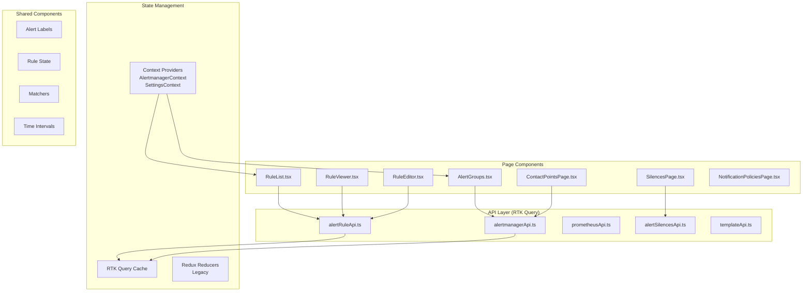

### Key Routes

| Route | Component | Description |
|-------|-----------|-------------|
| `/alerting` | Home | Alerting home page |
| `/alerting/list` | RuleList | Rules list (v1/v2) |
| `/alerting/new/:type?` | RuleEditor | Create new rule |
| `/alerting/:id/edit` | RuleEditor | Edit existing rule |
| `/alerting/notifications` | ContactPoints | Contact points |
| `/alerting/routes` | NotificationPolicies | Notification policies |
| `/alerting/silences` | Silences | Silence management |

---

## Request Flows

### Rule Evaluation Flow

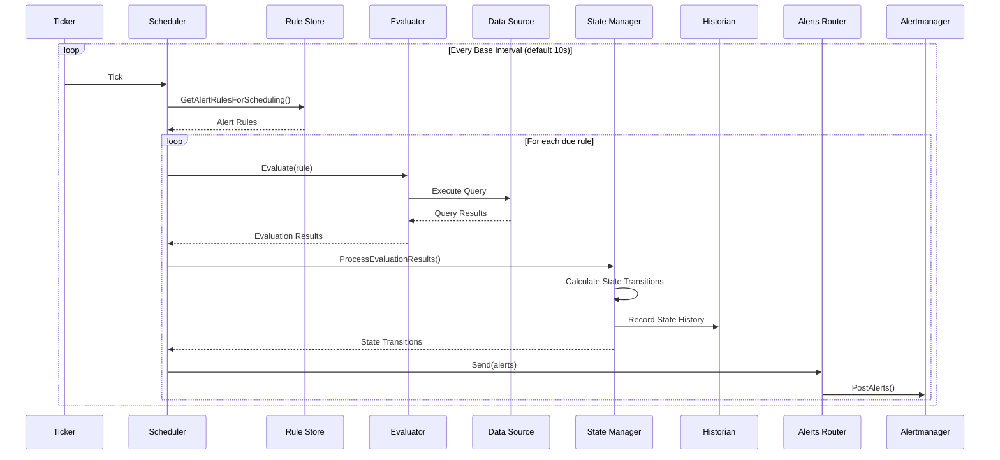

### State Transition Logic

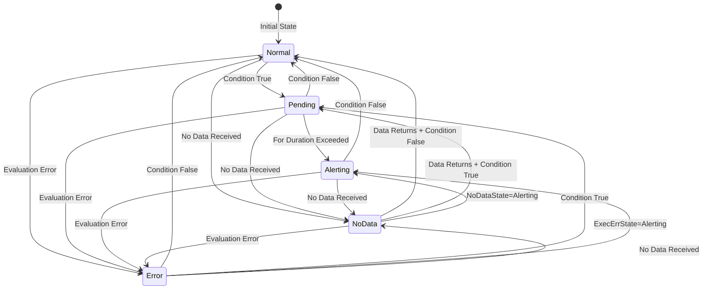

### Alert Rule CRUD Flow

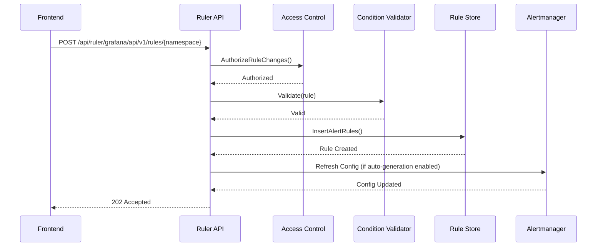

### Notification Delivery Flow

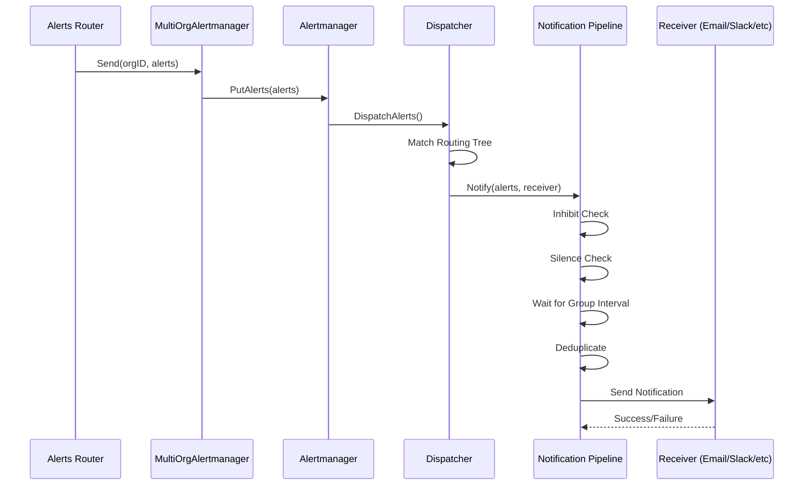

### Silence Management Flow

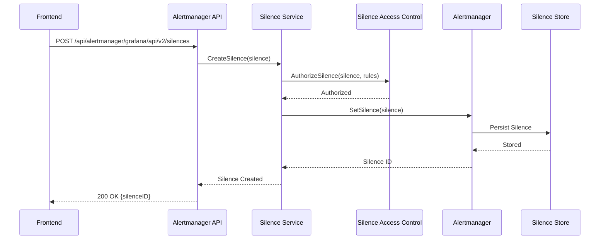

---

## Data Models

### Alert Rule Model

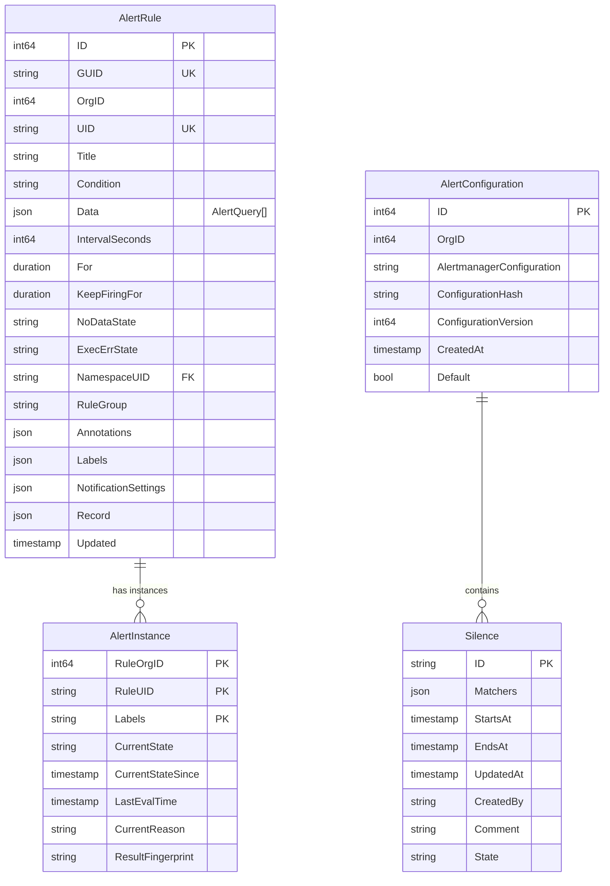

### Frontend Type Definitions

```typescript
// Rule Form Types
enum RuleFormType {
  grafana = 'grafana-alerting',
  grafanaRecording = 'grafana-recording',
  cloudAlerting = 'cloud-alerting',
  cloudRecording = 'cloud-recording',
}

interface RuleFormValues {
  name: string;
  type?: RuleFormType;
  dataSourceName: string | null;
  group: string;
  labels: Array<{ key: string; value: string }>;
  annotations: Array<{ key: string; value: string }>;
  queries: AlertQuery[];
  condition: string | null;
  noDataState: GrafanaAlertStateDecision;
  execErrState: GrafanaAlertStateDecision;
  folder: Folder | undefined;
  evaluateEvery: string;
  evaluateFor: string;
}

// Combined Rule (merges Prometheus + Ruler data)
interface CombinedRule {
  name: string;
  query: string;
  labels: Labels;
  annotations: Annotations;
  promRule?: Rule;
  rulerRule?: RulerRuleDTO;
  namespace: CombinedRuleNamespace;
  group: CombinedRuleGroup;
  instanceTotals: AlertInstanceTotals;
}
```

---

## Dependencies

### Backend Dependencies

```mermaid
graph TB
    subgraph "Core Grafana Services"
        DB[db.DB]
        KV[kvstore.KVStore]
        AC[accesscontrol.AccessControl]
        Folder[folder.Service]
        DS[datasources.CacheService]
        Secrets[secrets.Service]
        Quota[quota.Service]
    end

    subgraph "Alerting Services"
        AlertNG[AlertNG]
        Schedule[Scheduler]
        State[State Manager]
        Notifier[MultiOrgAlertmanager]
        Store[DBstore]
    end

    subgraph "External Libraries"
        Prometheus[github.com/prometheus/alertmanager]
        GrafanaAlerting[github.com/grafana/alerting]
    end

    AlertNG --> DB
    AlertNG --> KV
    AlertNG --> AC
    AlertNG --> Folder
    AlertNG --> DS
    AlertNG --> Secrets
    AlertNG --> Quota

    Schedule --> Store
    State --> Store
    Notifier --> Store
    Notifier --> Prometheus
    Notifier --> GrafanaAlerting
```

### Frontend Dependencies

```mermaid
graph TB
    subgraph "Grafana Packages"
        GrafanaUI[@grafana/ui]
        GrafanaData[@grafana/data]
        GrafanaRuntime[@grafana/runtime]
        GrafanaScenes[@grafana/scenes]
        GrafanaAlerting[@grafana/alerting]
        GrafanaAPIClients[@grafana/api-clients]
    end

    subgraph "External Libraries"
        ReactHookForm[react-hook-form v7]
        RTK[@reduxjs/toolkit]
        Emotion[@emotion/css]
        Lodash[lodash]
        MSW[msw - testing]
    end

    subgraph "Alerting Frontend"
        Components[Components]
        APIs[API Slices]
        Hooks[Hooks]
    end

    Components --> GrafanaUI
    Components --> GrafanaData
    Components --> Emotion
    APIs --> RTK
    APIs --> GrafanaAPIClients
    Hooks --> GrafanaRuntime
```

---

## Business Logic

### Rule Evaluation Pipeline

1. **Scheduling**: The scheduler maintains a tick-based loop (default 10s interval)
2. **Rule Fetching**: Queries database for rules due for evaluation based on `IntervalSeconds`
3. **Query Execution**: Evaluator executes data queries against configured data sources
4. **Condition Evaluation**: Expression service evaluates the condition RefID
5. **State Calculation**: State manager determines new state based on:
   - Evaluation results
   - Previous state
   - `For` duration (pending period)
   - `NoDataState` and `ExecErrState` configurations
6. **History Recording**: State transitions recorded to historian (annotations, Loki, or both)
7. **Alert Routing**: Alerts sent to internal Alertmanager or external Alertmanagers

### Alertmanager Processing

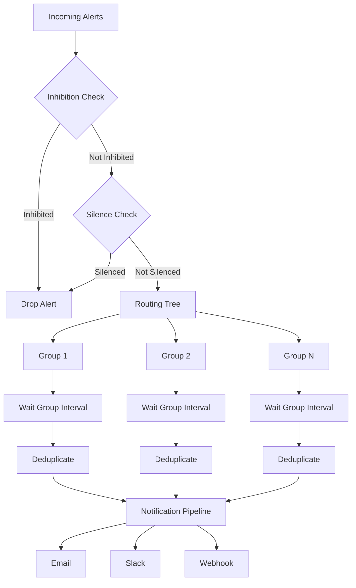

### Access Control Model

```mermaid
flowchart TB
    subgraph "Rule Access"
        RuleRead[alerting.rule:read]
        RuleCreate[alerting.rule:create]
        RuleWrite[alerting.rule:write]
        RuleDelete[alerting.rule:delete]
    end

    subgraph "Instance Access"
        InstanceRead[alerting.instance:read]
        InstanceCreate[alerting.instance:create]
        InstanceWrite[alerting.instance:write]
    end

    subgraph "Notification Access"
        NotifRead[alerting.notifications:read]
        NotifWrite[alerting.notifications:write]
    end

    subgraph "Silence Access"
        SilenceRead[alerting.silences:read]
        SilenceCreate[alerting.silences:create]
        SilenceWrite[alerting.silences:write]
    end

    RuleRead --> Viewer[Viewer Role]
    InstanceRead --> Viewer
    NotifRead --> Viewer
    SilenceRead --> Viewer

    RuleCreate --> Editor[Editor Role]
    RuleWrite --> Editor
    RuleDelete --> Editor
    InstanceCreate --> Editor
    InstanceWrite --> Editor
    NotifWrite --> Editor
    SilenceCreate --> Editor
    SilenceWrite --> Editor
```

### Configuration Hierarchy

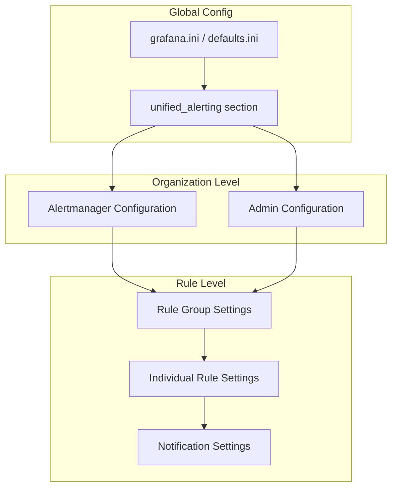

### Multi-Tenancy Model

- Each organization has its own:
  - Alert rules
  - Alert instances
  - Alertmanager configuration
  - Contact points and notification policies
  - Silences and mute timings

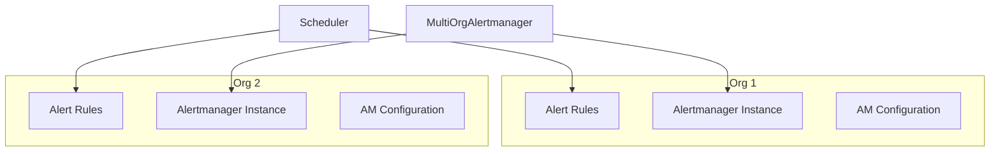

---

## Key Files Reference

### Backend

| File | Purpose |
|------|---------|
| `pkg/services/ngalert/ngalert.go` | Main service entry point, Wire DI provider |
| `pkg/services/ngalert/schedule/schedule.go` | Rule evaluation scheduler |
| `pkg/services/ngalert/state/manager.go` | Alert state management |
| `pkg/services/ngalert/notifier/multiorg_alertmanager.go` | Multi-tenant Alertmanager |
| `pkg/services/ngalert/api/api.go` | API handler registration |
| `pkg/services/ngalert/store/alert_rule.go` | Rule storage operations |
| `pkg/services/ngalert/models/alert_rule.go` | Alert rule domain model |

### Frontend

| File | Purpose |
|------|---------|
| `public/app/features/alerting/unified/api/alertingApi.ts` | RTK Query base configuration |
| `public/app/features/alerting/unified/api/alertRuleApi.ts` | Rule API endpoints |
| `public/app/features/alerting/unified/state/AlertmanagerContext.tsx` | AM context provider |
| `public/app/features/alerting/unified/hooks/useAbilities.ts` | RBAC hooks |
| `public/app/features/alerting/unified/utils/rules.ts` | Rule type guards |

---

## Summary

The Grafana alerting module is a comprehensive system with:

1. **Backend**: Go services using Wire DI for initialization, with clear separation between API handlers, business logic services, and data storage
2. **Frontend**: React/TypeScript application using RTK Query for data fetching, react-hook-form for forms, and Emotion for styling
3. **Evaluation Loop**: Ticker-based scheduler that evaluates rules against data sources and manages state transitions
4. **Notification Pipeline**: Prometheus Alertmanager-compatible notification routing with support for multiple receivers
5. **Access Control**: Fine-grained RBAC for all alerting resources
6. **Multi-tenancy**: Full organization isolation for rules, configurations, and notifications
